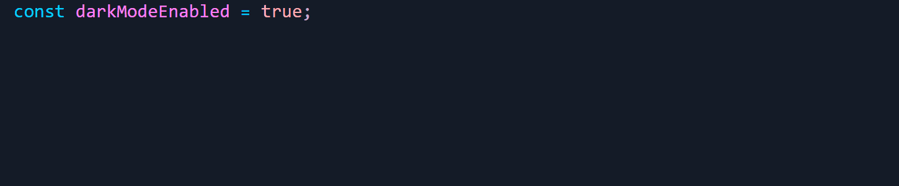

# QuikLog

QuikLog is a VS Code extension that lets you quickly insert debug log statements for any variable in your code with a simple keyboard shortcut or context menu action. Stop writing repetitive console.log statements manually and let QuikLog do it for you!

> ⚡ Instantly insert log statements — no more typing `console.log()` by hand!

**Example:**

## Features

- **One-Click Logging**: Highlight any variable and instantly insert a formatted log statement
- **Multi-Language Support**: Works with JavaScript, TypeScript, Python, Java, Gherkin, C, C++, and C#
- **Smart Formatting**: Automatically formats log statements according to language conventions
- **Keyboard Shortcut**: Use `Ctrl+Alt+L` (or `Cmd+Alt+L` on Mac) for lightning-fast logging
- **Context Menu Integration**: Right-click and select "Insert QuikLog" from the context menu

### How It Works

1. Highlight a variable in your code
2. Press `Ctrl+Alt+L` (or right-click and select "Insert QuikLog")
3. Done! A formatted log appears on the next line

## Supported languages (templates)

The table below shows the log template QuikLog inserts for a given language. Replace `variable` with your selected identifier or expression.

| Language                   | Inserted template                                     | Notes                                                       |
| -------------------------- | ----------------------------------------------------- | ----------------------------------------------------------- |
| JavaScript / TypeScript    | `console.log('variable: ', variable);`                | Uses single quotes and a trailing comma for readable output |
| Python                     | `print('variable: ', variable)`                       | Python print without semicolon                              |
| Java                       | `System.out.println("variable: " + variable);`        | Uses string concatenation for Java                          |
| Gherkin (Feature / Karate) | `* print 'variable: ', variable`                      | Karate feature file print statement                         |
| C                          | `printf("%s: %d\n", "variable", variable);`           | Standard C printf                                           |
| C++                        | `std::cout << "variable: " << variable << std::endl;` | Uses iostream                                               |
| C#                         | `Console.WriteLine("variable: " + variable);`         | .NET console output                                         |

If your language isn't listed, open an issue — templates are easy to add.

---

## Installation

### VS Code
1. Open the Extensions view (Ctrl+Shift+X)
2. Search for "QuikLog" or run: `ext install codeygallup.quiklog`

Or download from [VisualStudio Marketplace](https://marketplace.visualstudio.com/items?itemName=codeygallup.quiklog)

### IntelliJ IDEA
1. Open Settings → Plugins
2. Search for "QuikLog" in the Marketplace
3. Click Install

Or download from [JetBrains Marketplace](https://plugins.jetbrains.com/plugin/30096-quiklog)

---

## Usage

- Keyboard shortcut: Highlight text and press Ctrl+Alt+L (Cmd+Alt+L on macOS).
- Context menu: Right-click a selection and choose "Insert QuikLog".
- Command Palette: Ctrl+Shift+P (Cmd+Shift+P on macOS), then run "Insert QuikLog".

Behavior notes:

- If no text is selected you'll receive an instruction to select a variable or expression.
- The log statement is inserted on the next line and preserves the current indentation level.

---

## Extension settings

QuikLog works out of the box with no required settings. Future releases may add customization such as:

- Default logging style (short vs verbose)
- Toggle per-language templates
- Customizable keyboard shortcut

---

## Known issues

- Requires a selection — nothing will be inserted if no text is selected.
- Language detection is based on the editor language; files with uncommon extensions may not be recognized.

If you encounter other issues, please open an issue in the repository.

---

## Release notes

### 1.2.0

- Fixed Gherkin language detection for .feature files
- Added C, C++, and C# support

### 1.1.0

- Added support for JSX and TSX files
- Cursor detection for variables (no selection required)
- Improved snippet indentation

### 1.0.0

- Initial release: Insert logs for JavaScript/TypeScript, Python, Java, and Feature files. Keyboard shortcut and context menu integration.

---

## Contributing

Contributions, issues, and feature requests are welcome. To contribute:

1. Fork the repo.
2. Create a branch for your change.
3. Open a pull request with a clear description.

See the project's GitHub page: https://github.com/codeygallup/QuikLog

---

## License

MIT © codeygallup

---

## Feedback

If QuikLog saves you time, please consider:

- ⭐ Starring the repository on GitHub
- ✍️ Leaving a review on the VS Code Marketplace
- 🐛 Opening issues for bugs or feature requests

Enjoy logging like a pro! 🐱‍💻
